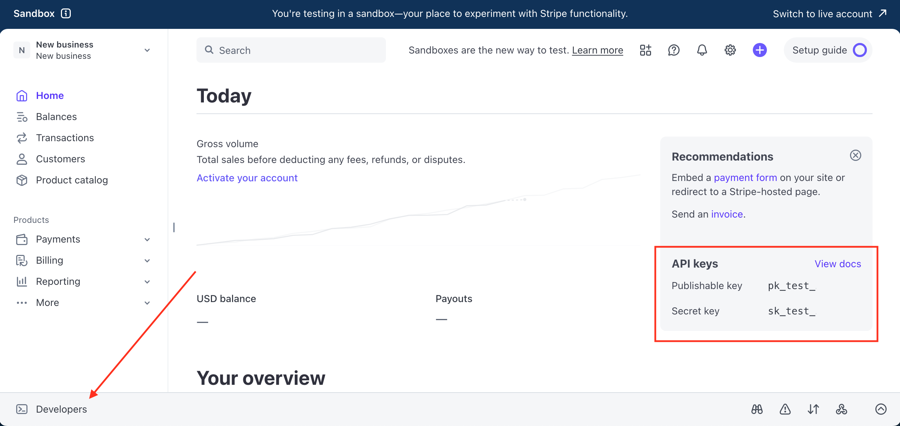

---
hide:
  - toc
---
Follow these steps to set up and test a $10 one-time payment flow. 
### 1. Get your Stripe keys
Stripe makes finding its API keys easy. 
 
- In the Stripe Dashboard → `Developers` → `API keys` →`Standard keys`. Copy your **Publishable key** (pk_test_...) and **Secret key** (sk_test_...).  
- Or, see your keys in the Recommendations box

You will need to slot these keys into the backend code found in  Step 4 later on.


 
> Keep these keys private. Test keys are fine to paste directly into your code while learning and testing. When you publish real code online, use environment variables instead of hardcoding keys to keep it secret.
### 2. Install Dependencies
Use your computer’s terminal to install Stripe’s SDK: `npm install stripe express`.
 
### 3. Create a project folder
Create a new desktop folder called `stripe-test` to organize your files. Inside the test folder, create a second folder named `templates`.
### 4. Generate backend server code
This backend code runs your local server. It listens for requests from your browser (frontend), connects to Stripe’s API, and returns a checkout link.
  
- Open [VS Code](https://vscode.dev/) and save the following code as `app.js` in your `stripe-test` folder.
  
**For JavaScript (Node/Express)**:
```
const express = require(“express”);
const stripe = require(“stripe”)(“sk_test_yourSecretKeyHere”);
const path = require(“path”);

const app = express();
app.use(express.json());

app.get(“/“, (req, res) => {
  res.sendFile(path.join(__dirname, “index.html”));
});

app.post(“/create-checkout-session”, async (req, res) => {
  try {
    const session = await stripe.checkout.sessions.create({
      mode: “payment”,
      line_items: [{
        price_data: {
          currency: “usd”,
          product_data: { name: “Test Payment” },
          unit_amount: 1000,
        },
        quantity: 1,
      }],
      success_url: “127.0.0.1:443:/success?session_id={CHECKOUT_SESSION_ID}”,
      cancel_url: “http://127.0.0.1:8443:443/cancel”,
    });
    res.json({ url: session.url });
  } catch (error) {
    res.status(500).json({ error: error.message });
  }
});

app.get(“/success”, (req, res) => res.send(“Thanks for your payment! (Test mode)”));
app.get(“/cancel”, (req, res) => res.send(“Payment canceled. Try again?”));

app.listen(443, () => console.log(“Server running on http://127.0.0.1:443”));
```
Remember to replace the in-line placeholder API keys with those you obtained in Step 1. If you have specific **Success** or **Cancel URLs** you’d like to redirect to, substitute them for the current `127.0.0.1:443` placeholders.
### 5. Generate frontend HTML
Your frontend is the part the user interacts with, AKA the website itself. Because we’re running a test, we’re creating a simple, stand-in HTML site with a "Pay $10" button. 
- Open [VS Code](https://vscode.dev/) and create a new document titled `index.html` inside your `templates` folder. 
- Paste the following HTML into the VS Code interface:
```
<!DOCTYPE html>
<html lang="en">
<head>
  <meta charset="UTF-8" />
  <title>Stripe Test</title>
  <script src="https://js.stripe.com/v3/"></script>
  <style>
    body { font-family: system-ui, sans-serif; padding: 2rem; }
    button { padding: 0.6rem 1rem; font-size: 1rem; cursor: pointer; }
  </style>
</head>
<body>
  <h1>Pay $10 (Test Mode)</h1>
  <button id="checkout-button">Pay $10</button>
  <script>
    document.getElementById("checkout-button").addEventListener("click", () => {
      fetch("/create-checkout-session", { method: "POST" })
        .then(res => res.json())
        .then(data => data.url ? (window.location = data.url) : alert("Error: " + (data.error || "Unknown")))
        .catch(err => alert("Network error: " + err.message));
    });
  </script>
</body>
</html>
```
#### How It All Fits Together
The **frontend** is the website. It’s the page a customer would visit on your store, like a product page with a "Pay $10" button. 

The **backend** is the behind-the-scenes code — your **Express** server that runs silently in the background, handling what happens when someone clicks the "Pay $10" button. 

Here’s a flow chart of the secure payment system:

```
Customer Browser (index.html)
        |
        | 1) Click “Pay $10”
        v
Your Backend (app.py, secret key)
        |
        | 2) Create Checkout Session via Stripe API
        v
Stripe Checkout (hosted page)
        |
        | 3) Customer pays (test card)
        v
Stripe -> Your Site
		|
		| 4) Stripe redirects to success_url or cancel_url
		|
```
Those are the basics. Now, you’re ready to launch your local server, test your API keys, and make a transaction. 