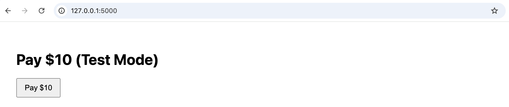
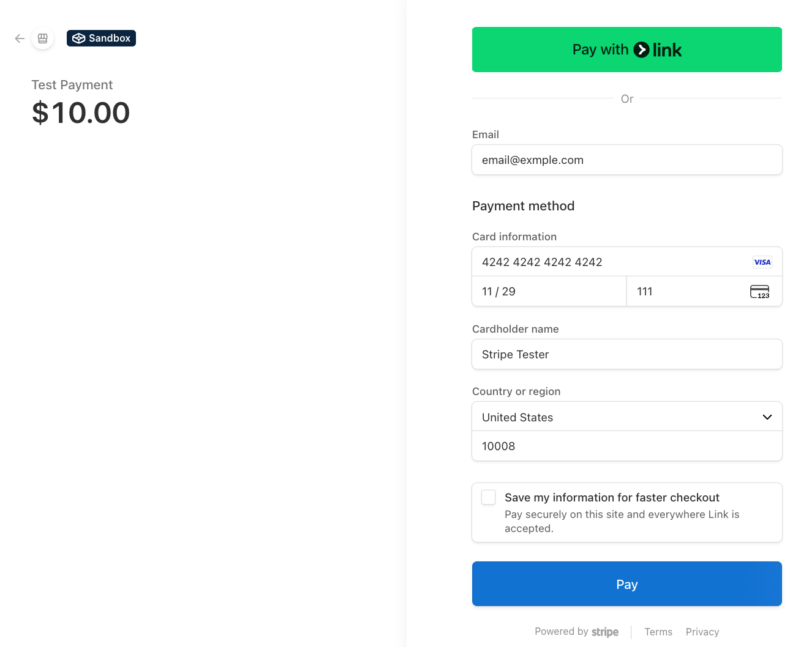

---
hide:
  - toc
---
First, make sure your `stripe-test` folder looks like this:
``` 
stripe-test/
├─ app.js
└─ templates/
   └─ index.html
```
### 6. Start a Local Server
Open a terminal and navigate to your project with `cd ~/Desktop/stripe-test`. Then start the server with: `node app.js`. 

Look for `“Server running on port 443”` to confirm your local server is live. Terminal will also show you:
 
- A bold, red-lettered warning reminding you that this is a development server not meant for hosting a live site. 
- Debugging tools unique to this session.

Note: We’re using code so that Node serves a self-signed HTTPS page locally. This avoids mixed-content warnings and lets you rehearse a production-style redirect flow to your Success URL (that’s also why we use port 443).

See Troubleshooting section should errors occur. Otherwise, **leave this terminal open during the test**.
### 7. Trigger a Checkout Session
Create a Checkout Session (the temporary Stripe “shopping cart”) directly from your frontend page. Just:

**Visit your test HTML site:**
Continue to the simple front end page we made (the `index.html` file).
- Copy-paste the link from Step 6 into your browser: `https://127.0.0.1:443`
- Your browser may warn you about an untrusted site; accept the warning and proceed. The site is running off your own server, so there shouldn’t be any malicious actors present. 

**Click the link.**
After clicking past the warning, your bare-bones test site should appear, looking like this:



- Click the “Pay $10” button so that your frontend (index.html) sends a request to your backend (app.js). 
	- The backend then uses your secret key to ask Stripe’s API for a Checkout Session. A Stripe webpage loads. (Remember, this is a test; no money changes hands).

If your site renders as raw HTML, your text editor may have added unseen markup to the code. Create a new `index.html` in a plain-text editor like VC Code.
### 8. Make a test payment
Fill out the Stripe payment form as you would any other.

- Enter an email (fake works here).
- Use **test card number:**
	- **For a successful payment**: `4242 4242 4242 4242`
	- **For a declined payment**: `4000 0000 0000 0002`
	- NOTE: This doesn’t trigger the Cancel URL; it responds with Stripe’s boilerplate error message. 
- Any future expiration date and any 3-digit CVC will work.
- Provide a name and location.
  
Then, submit payment.



If the test works, you will see confirmation responses in two separate locations. 
