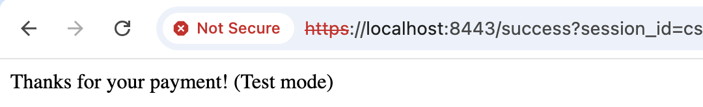
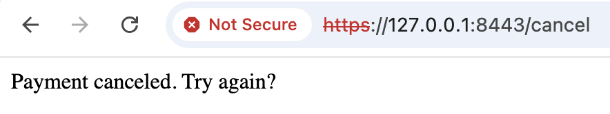
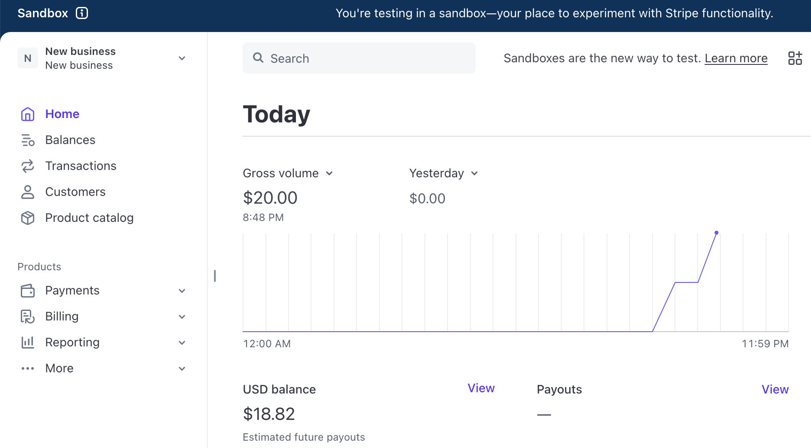
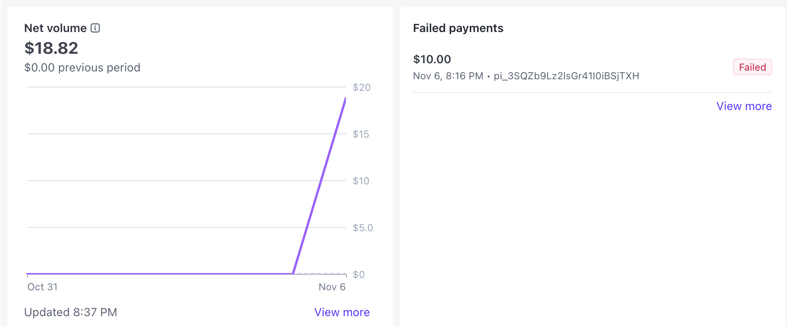
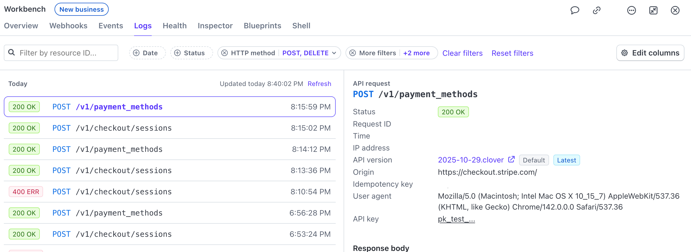

---
hide:
  - toc
---
Review the responses from both your browser and terminal (console). 
### Browser Response
If the test payment succeeds, Stripe redirects to your **Success URL**: `https://127.0.0.1:443/success`.
On this page, you’ll see: `“Thanks for your payment!”` 

> Use `HTTPS` locally if you want to see your fully loaded Success URL page; http works, but browsers might present `403` errors due to server/browser/security mismatches.

If the test payment fails (because, for instance, you used card number `4000 0000 0000 0002`), Stripe returns this boilerplate response:
`Your credit card was declined. Try paying with a debit card instead.`
If you’re not sure why a payment failed (e.g., you weren’t using card ’0002’), check your terminal’s output.
### Terminal / Console Response
When a transaction succeeds, your terminal prints something like: `Verified session: amount=1000 cents, status=paid`

This backend information comes from the `stripe.checkout.Session.retrieve(session_id)` call in your success route — something we baked into the code early on. This message confirms the amount and payment status retrieved securely from Stripe.

If a transaction fails, your terminal displays an error message or status code, such as one of the following: 
 
- `{“error”: “Invalid API Key provided”}`. 
- `400` (bad request) 
- `403` (forbidden).

These responses help you identify configuration issues, like an incorrect key, missing dependency, or request made to the wrong port. Check the troubleshooting page for more details.
### Review Cancel URL
Stripe doesn’t have a built-in “cancel” button, and abandonment (like back or close) leaves the session open until it expires (24 hours by default), without an immediate redirect. To test Cancel URLs:
  
- In your browser bar, type `https://127.0.0.1:443/cancel`.
- You should see our placeholder cancel message: 

If a customer actively cancels during Checkout, Stripe uses the cancel_url (when set). If they simply abandon the page, the Session remains open and later expires (default ~24 hours).
### Verify the Flow
To be certain, run the full test from start to finish:
  
- Restart your server (`Ctrl + C` → rerun `node app.js`). 
- Visit your local site. 
- Click Pay $10 and complete checkout with the test card. 
	- **Success**: `4242 4242 4242 4242` 
	- **Decline**: `4000 0000 0000 0002` 
- Watch for verification messages in both your browser and terminal. If you see: 
	- 		`“Thanks for your payment!”` in the browser 
	- 	`“Verified session…”` in the terminal 

**Your local payment flow is working!**

Even better? Everything is happening safely in Stripe’s test mode, so no real money moves yet.
### Where to Check in Stripe
If you want to confirm that your test payments actually reached Stripe’s system, you can view the activity in your Stripe Dashboard. Make sure the Dashboard is in **Sandbox** testing mode or you won’t see the test events. Then:

- Go to dashboard.stripe.com to see “**Today’s Payments**” for a detailed log of every API call your backend made (including `checkout.session.created` and `checkout.session.completed`).

> Fun Note: tinker with your HTML and app.py to adjust test payment amounts. Initiate as many tests as you want  to run up your fake test money. 

- Scroll further down the dashboard page, or navigate to **Payments** → **All Payments**, to see more useful charts, like Net Volume and Failed Payments. 

- Inspect the exact request and response data sent between your local server and Stripe’s API by going **Developers** → **Logs**.

These confirm your server successfully talked to Stripe, created a session, and completed the test payment flow.

> **Note**: You’ll only see these logs while your dashboard is in Test Mode. They don’t represent real payments.